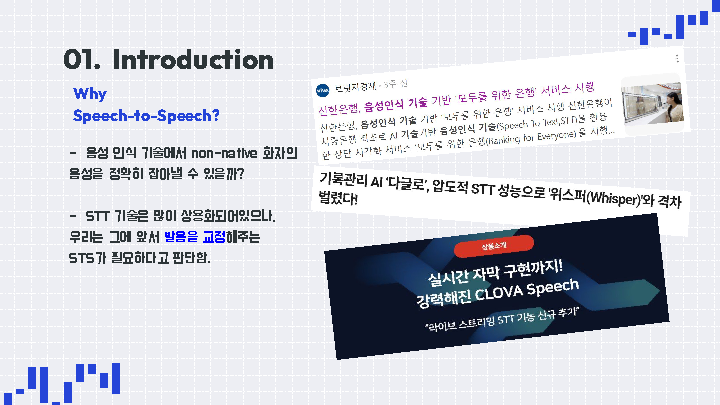

## 24-2_Modelingproject_CV2_N3-VC : you can speak like a native

#### CV2조 - 11기 : 양주원, 김여원 / 12기 : 김경환, 전종욱

## 💡 **주제**
- CV2팀은 SpeechSplit모델을 학습하는 데에 사용된 VCTK 음성 데이터셋을 활용하여 영어 억양 변환 프로젝트를 진행했습니다.
- SpeechSplit모델에 VAE 블럭을 추가하여 아키텍쳐를 구성하고, 억양이 강한 음성 데이터를 입력하면 native한 억양으로 바꿔주는 task를 수행하였습니다. 
---
# Overview
## Cover Page

